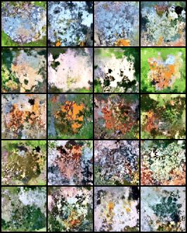
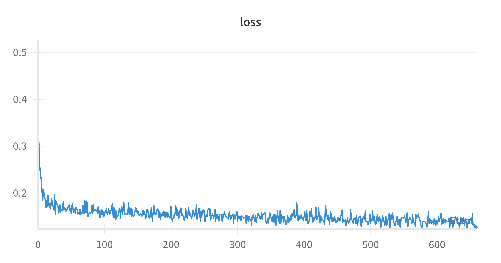
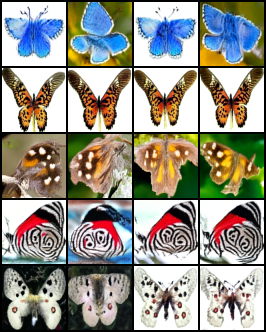

# nanoDiT

An _educational_ repository to show rectified-flow training of class-conditional DiTs for image generation (~600 LoC). The repository draws inspiration from legendary works like [nanoGPT](https://github.com/karpathy/nanoGPT), [nanoVLM](https://github.com/huggingface/nanoVLM), and tries to do something similar for
rectified-flow based image generation. It is meant to be hackable and a friendly starting point for folks wanting to get started in the area.

<div align="center">

</div>

## Repo structure

Core DiT implementation is in `model.py`, adapted heavily from the [original implementation](https://github.com/facebookresearch/DiT/blob/ed81ce2229091fd4ecc9a223645f95cf379d582b/models.py). Training is implemented in the `train.py` file. The repo has two dependencies -- `torch` and `torchvision` (needed for data loading).

## Getting started

The repo implements class-conditional DiT training with the [`butterflies` dataset](https://www.kaggle.com/datasets/phucthaiv02/butterfly-image-classification). Download the dataset:

```python
from huggingface_hub import snapshot_download

snapshot_download(
    repo_id="sayakpaul/butteflies_with_classes", repo_type="dataset", local_dir="butterflies"
)
```

Start training:

```bash
python train.py
```

`train.py` has reasonable defaults set as constants at the top of the file. Feel free to modify them as needed. Running the script as is yields the following loss curve:

<div align="center">

</div>

The final step of intermediate result visualization yields:

<div align="center">

</div>

By default, we train on the 64x64 resolution to keep the runtime short and memory requirements lower.

If you're running training on MPS, please change the `DEVICE` accordingly. The iterative sampling process for inference is implemented in the `sample_conditional_cfg()` function already.

## Notes

The repo aims at bringing the essential components while striving to be minimal and reasonable:

* Pixel-space instead of latent-space because VAE is a separate magic which was purposefully discarded from this repo.
* DiT as the base architecture as this is the core behind modern models like Flux.
* Class-conditional to show how to embed conditions other than just timesteps.
* Rectified flows for a simpler alternative to DDPM-style diffusion training.
* You can fiddle around with the model and the training setup in your local laptop.